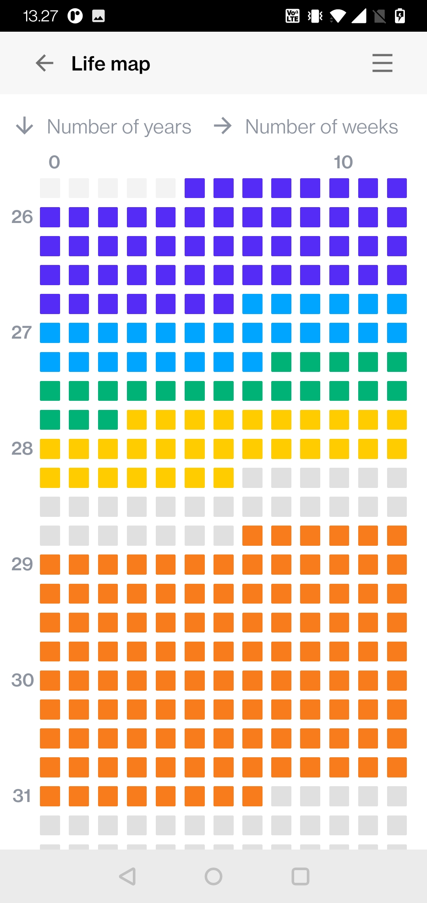

# Achievement

[](http://badges.mit-license.org)

A ReactJS Progressive Web Application with Firebase Authentication and Firestore hooks.
>This hobby project aims to provide web-based tools for setting life goals. The key features are the ability to create and check off a bucket list and create a grand overview of the remaining weeks of your life. 

*Michael Guldborg 2021*

<p align="center">
	<a href="https://achivement.michaelguldborg.dk">
		https://achivement.michaelguldborg.dk
	</a>
</p>

<p align="center">
	<a href="#Preview">Preview</a> •
	<a href="#Features">Features</a> •
	<a href="#Development">Development</a> •
	<a href="#refferences">References</a>
</p>

## Preview

<p align="center">
	
	
	
	
	
</p>


## Features

| Name | Description | Done |
| --- | --- | :---: |
| Authentication | Sign in, sign up, forgot password  | &#9745; |
| Create bucket list challenge |  | &#9745; |
| Write challange notes |  | &#9745; |
| Create over of life in weeks |  | &#9745; |
| --- | --- |  |
| Netlify deploy flow |  | &#9745; |
| <b>Total</b> | --- | 5/5

## Development

```bash
# Install dependencies
$ yarn

# Run on application
$ flutter run

# Deploy to production
$ git push origin master
```


## References
- [GitHub](https://github.com/)
- [JavaScript](https://www.javascript.com/)
- [Typescript](https://www.typescriptlang.org/)
- [Yarn](https://yarnpkg.com/)
- [ReactJS](https://reactjs.org/)
- [Material-UI](https://mui.com/)
- [Firebase Authentication](https://firebase.google.com/docs/auth/)
- [Firebase Analytics](https://firebase.google.com/docs/analytics/)
- [Firebase Firestore](https://firebase.google.com/docs/firestore)
- [Netlify](https://www.netlify.com/)
- [Elastic](https://www.elastic.co/)

