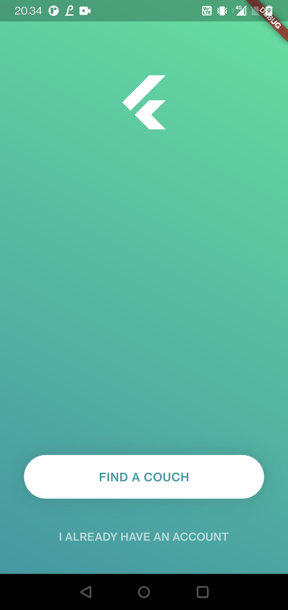
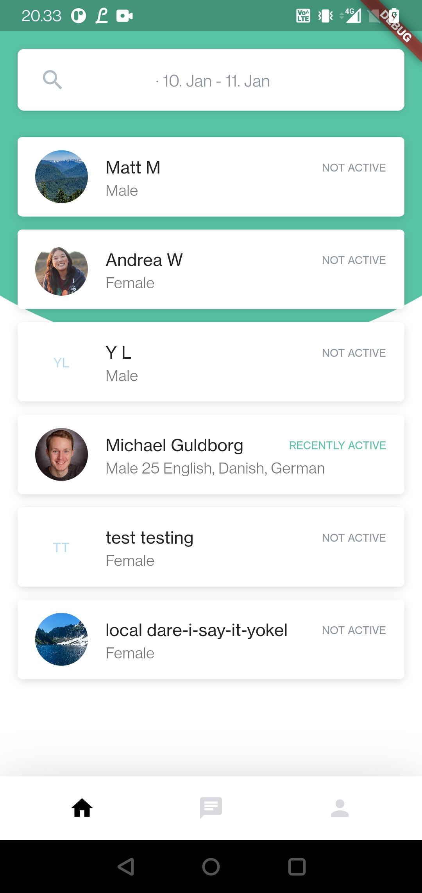
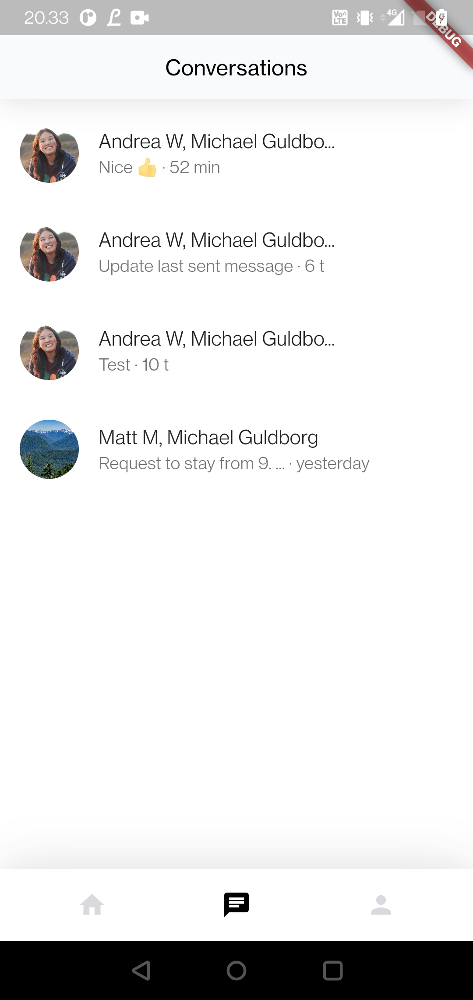

# CitySurfingFlutter

A mobile app project made with [Flutter](https://flutter.dev).

<p align="center">
  <a href="#Download">Download</a> •
  <a href="#Features">Features</a> •
  <a href="#Development">Development</a> •
  <a href="#Notes">Notes</a> •
  <a href="#license">License</a>
</p>

## Preview

<p align="center">
    
    
    
</p>

## Download

You can download the latest release on Android and iOS here.\

<a href="#"></a>
<a href="#"></a>
<a href="https://city-surfing.netlify.app/"></a>

## Features

| Name | Description | Done |
| --- | --- | :---: |
| Sign up with email |  | &#9745; |
| Sign in with email |  | &#9745; |
| Forgot password |  | &#9745; |
| Update user information |  | &#9745; |
| Upload profile picture |  | &#9745; |
| Search for host | Search by "country" and "city" | &#9745; |
| Create a host request | | &#9745; |
| Chat with hosts |  | &#9745; |
| --- | --- |  |
| Netlify deploy flow |  | &#9745; |
| iOS deploy flow |  | &#9744; |
| Android deploy flow |  | &#9744; |
| Firebase Version Control | | &#9744; |
| Firebase Analytics | | &#9745; |
| Firebase Crashlytics |  | &#9745; |
| Firebase Notifications | | &#9745; |
| <b>Total</b> | --- | 12/15

## Development

```bash
# Install dependencies
$ flutter pub get

# Build and run on connected device or emulator
$ flutter run

# Build and run in chrome browser
$ flutter run -d chrome
```

## Notes

* Add firebase function to send push notifications (firebase-blase-plan)
* Make animated chat signup flow with buttons (~ 6 hours)

<!--
* Add red dot to navigation bar
* Add notification settings button
* Improve the profile page UI
* Add ios/android splash screen before flutter loads
-->

## License

[MIT](/LICENSE)