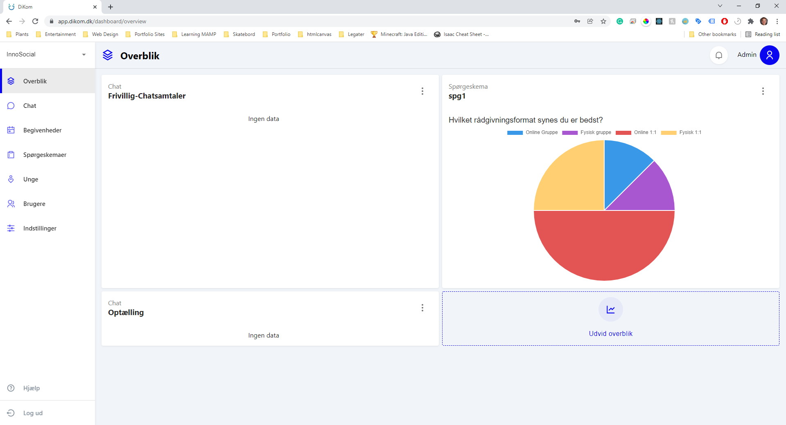
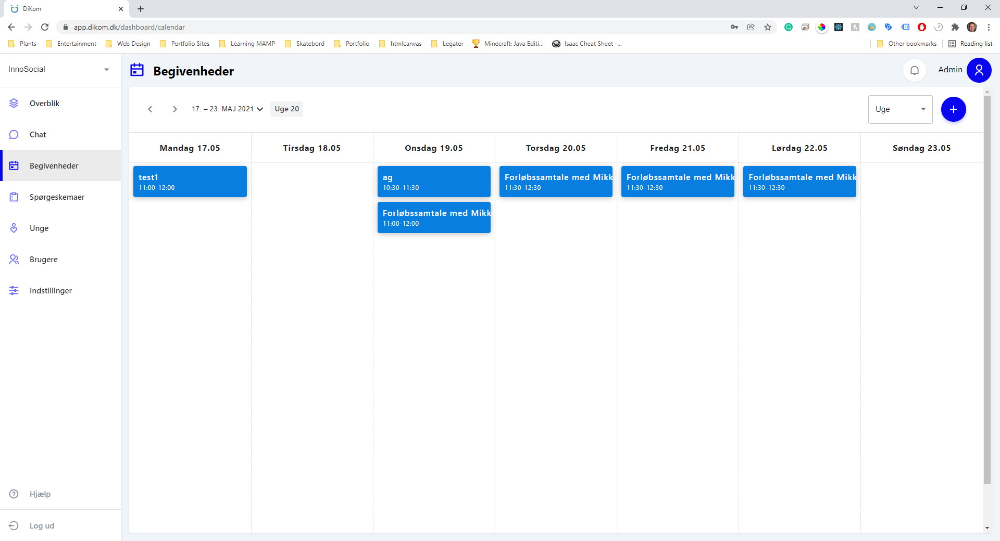
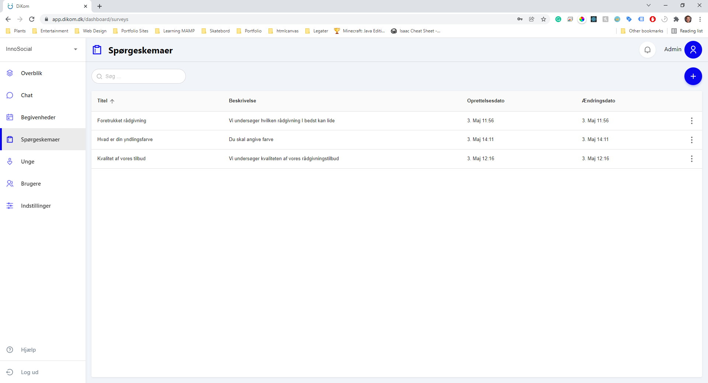
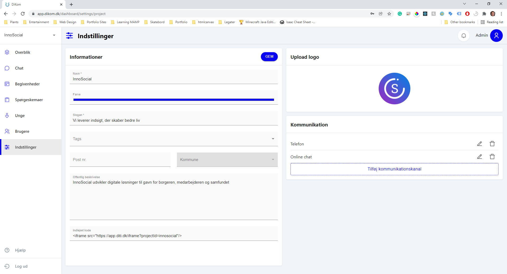

 
# DiTi

> DiTi is a digital platform for young people to find some one to talk to about their problems. The platform is designed as a mobile application with an overview of all the social efforts organisations in denmark. Users can reach out anonymously and get in touch with a counsler. The app facilitates scheduling events such as counseling sessions which are managed through the counselor web application.

*Innosocial ApS 2020*

<p align="center">
	<a href="https://diti.dk">
		diti.dk
	</a>
</p>


<p align="center">
  <a href="#preview">Preview</a> •
  <a href="#features">Features</a> •
  <a href="#development">Development</a> •
  <a href="#team">Team</a> •
  <a href="#refferences">Refferences</a>
</p>

## Preview

<p align="center">
	
	
	
	
</p>

## Features

| Name | Description | Done |
| --- | --- |  :---: |
| Authentication | | &#9745;
| User profile | | &#9745;
| User management | | &#9745;
| Anonymous chat | | &#9745;
| Calendar and events planning | | &#9745;
| Questionareis and response charts | | &#9745;
| Inqueiry registration | | &#9745;
| Social effort configuration | | &#9745;
| Support articles | | &#9745;
| --- | --- |  |
| Neltify deploy flow | | &#9745;
| AWS backend deploy flow | | &#9745;
| Firebase Analytics | | &#9745;
| <b>Total</b> | | 12/12


## Development

```bash
# Install dependencies
$ yarn

# Run application
$ yarn start

# Run application tests
$ yarn test

# Deploy to production
$ git push origin master
```


## Team
- Fullstack developer - [Michael Guldborg](http://michaelguldborg.dk)
- Fullstack developer - [Chritian Poulsen](https://www.christianpoulsen.dk/)
- Fullstack developer - [Nicolai Lassen](https://nmtl.dk/)
- Frontend web developer - [Beta Kalisa](#)
- Frontend mobile developer - [Sebastian Tønne](#)


## Refferences
- --- *Frontend* ---
- [JavaScript](https://www.javascript.com/)
- [Typescript](https://www.typescriptlang.org/)
- [Yarn](https://yarnpkg.com/)
- [ReactJS](https://reactjs.org/)
- [Redux](https://redux.js.org/)
- [Material-UI](https://mui.com/)
- [Flutter](https://flutter.dev/)
- [Netlify](https://www.netlify.com/)
- [GitLab](https://gitlab.com/)
- [GitLab pipeline](https://docs.gitlab.com/ee/ci/pipelines/)
- [Firebase Analytics](https://firebase.google.com/docs/analytics/)
- [Rest API](https://restfulapi.net/)
- --- *Backend* ---
- [C#](https://docs.microsoft.com/en-us/dotnet/csharp/)
- [.Net Core](https://docs.microsoft.com/da-dk/dotnet/)
- [AWS DynamoDB](https://aws.amazon.com/dynamodb/)
- [AWS CodeCommit](https://aws.amazon.com/codecommit/)
- [AWS CodeBuild](https://aws.amazon.com/codebuild/)
- [AWS CodePipeline](https://aws.amazon.com/codepipeline/)
- [AWS Elastic Container Registy](https://aws.amazon.com/ecr/)
- [AWS Elastic Beanstalk](https://aws.amazon.com/elasticbeanstalk/)
- [Docker](https://www.docker.com/)
- [Elastic](https://www.elastic.co/)
