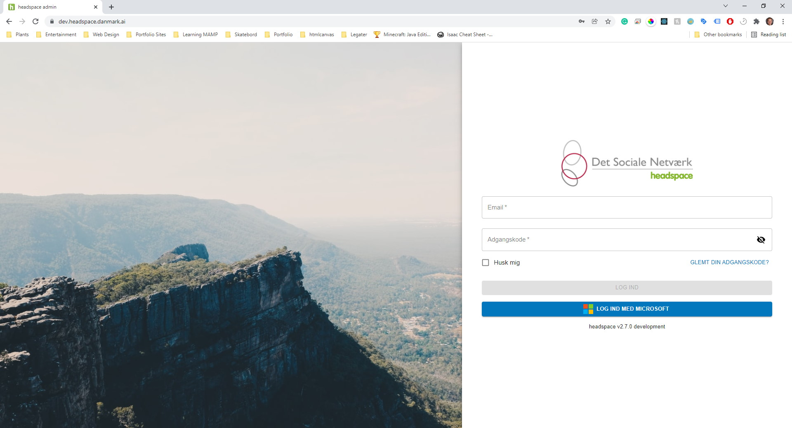
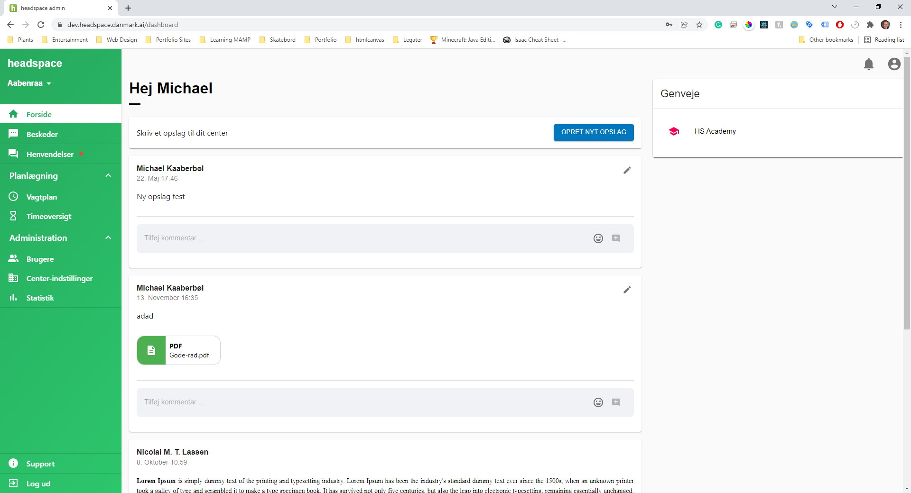
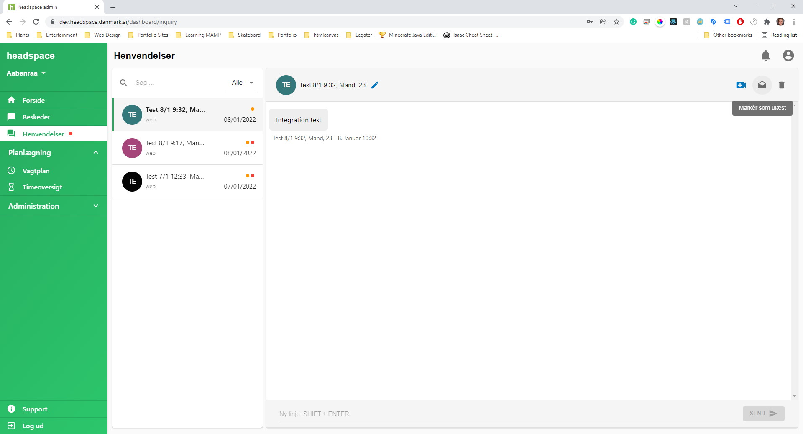
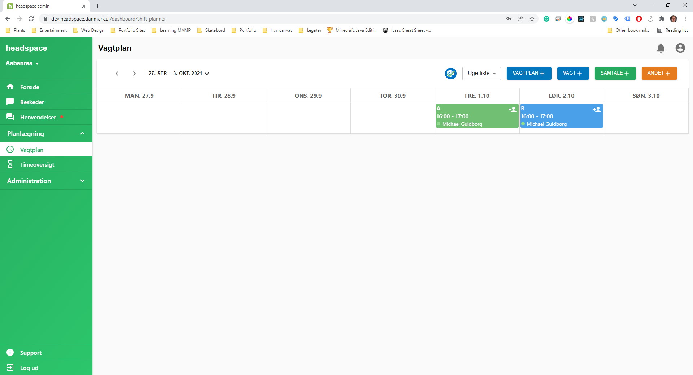

 
# Headspace admin

> This is the client side application of the Headspace DK intranet. The application is designed to manage both calendars of counselors and voulenteers. Additionally the platform provides an anonymous web-to-sms communication channel with vulnerable young people looking for someone to talk to.

*Innosocial ApS 2019*

<p align="center">
	<a href="https://admin.headspace.dk">
		admin.headspace.dk
	</a>
</p>


<p align="center">
  <a href="#preview">Preview</a> •
  <a href="#features">Features</a> •
  <a href="#development">Development</a> •
  <a href="#team">Team</a> •
  <a href="#refferences">Refferences</a>
</p>

## Preview

<p align="center">
	
	
	
	
</p>

## Features

| Name | Description | Done |
| --- | --- |  :---: |
| Authentication | Authenticate users with email and password | &#9745;
| Anonymous chat | Chat view to interact with common people | &#9745;
| Anonymous sms chat | Hooking the chat up to m-mobility sms provider api | &#9745;
| Calendar functionality |  | &#9745;
| Organisational posts | (with file attachments) | &#9745;
| --- | --- |  |
| Continous integration | Continous deployment flow with GitLab Runner | &#9745;
| Firebase Analytics | Usage statistics of web application | &#9745;
| <b>Total</b> | | 10/10


## Development

```bash
# Install dependencies
$ yarn

# Run application
$ yarn start

# Run application tests
$ cross-env REACT_APP_API_ENV=development yarn test

# Deploy to production
$ cross-env REACT_ENV=production
$ npm run build
$ firebase use prod
$ firebase deploy --only hosting
```


## Team
- Frontend developer - [Michael Guldborg](http://michaelguldborg.dk)
- Frontend developer - [Chritian Poulsen](https://www.christianpoulsen.dk/)
- Backend developer - [Nicolai Lassen](https://nmtl.dk/)


## Refferences
- [JavaScript](https://www.javascript.com/)
- [Typescript](https://www.typescriptlang.org/)
- [npm](https://www.npmjs.com/)
- [ReactJS](https://reactjs.org/)
- [Redux](https://redux.js.org/)
- [Material-UI](https://mui.com/)
- [Rest API](https://restfulapi.net/)
- [Firebase Hosting](https://firebase.google.com/docs/hosting/)
- [Firebase Analytics](https://firebase.google.com/docs/analytics/)
- [GitLab](https://about.gitlab.com/)
- [GitLab pipeline](https://docs.gitlab.com/ee/ci/pipelines/)
- [Docker](https://www.docker.com/)

