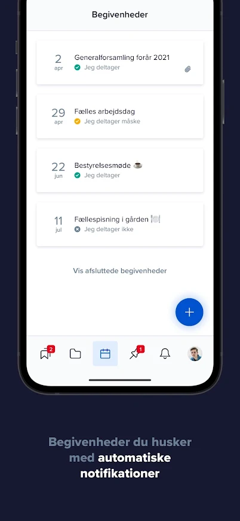
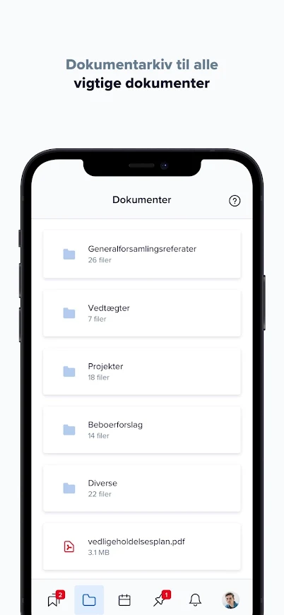
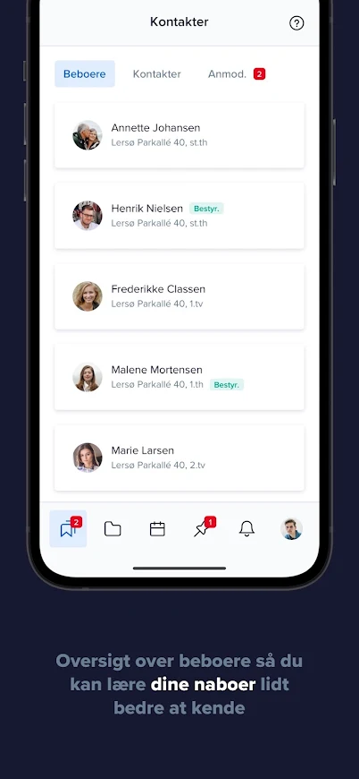
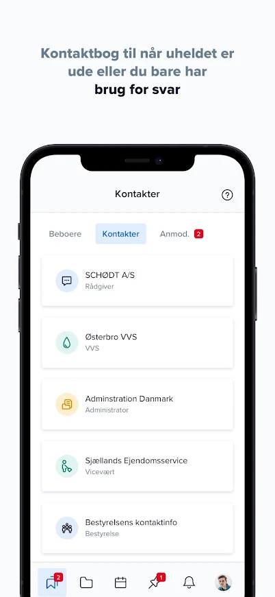

# Minejendom App


> This is the minejendom mobile app [Flutter](https://flutter.dev) project.

*MinEjendom ApS 2020*

<p align="center">
  <a href="https://minejendom.dk">
    minejendom.dk
  </a>
</p>


<p align="center">
  <a href="#preview">Preview</a> •
  <a href="#download">Download</a> •
  <a href="#development">Development</a> •
  <a href="#team">Team</a> •
  <a href="#refferences">References</a>
</p>

## Preview

<p align="center">
  
  
  
  
  
</p>

## Download

You can the latest release on Android and iOS.

<a href="https://play.google.com/store/apps/details?id=com.application.minejendom"></a>
<a href="#"></a>


## Development

[Minejendom API documentation](https://staging-api-v3.minejendom.dk/docs/)


```bash
# Install dependencies
$ flutter pub get

# Add the following key files
android/app/google-services.json

# Run app on connected device/emulator
$ flutter run
```

### Deployment

Continuous integration is set up with [Fastlane](#) and [GitLab Runner](https://docs.gitlab.com/runner/).

The following files not checked into source control is needed for this process to deploy the app without using the deploy flow

```bash
# Android
android/keystore.jks
android/keystore.properties
android/google_service_account_api.json
android/app/google-services.json

# iOS
ios/development-certificate.json
ios/distribution-certificate.json
ios/notifications-certificate.json
ios/Runner/GoogleService-Info.plist
ios/fastlane/Appfile
```

```bash
# Deploy app to iOS testflight and Android
$ git push origin staging

# Deploy app to iOS and Android production
$ git push origin master
```


If iOS deployment fails because of missing 2 factor authenticated session use the following command on the CI deployment machine to create a new web session (valid for 1 month)

```
$ fastlane spaceauth -u mail@michaelguldborg.dk
```

### Release

*Release iOS testflight to production*

- Open the developer console
https://appstoreconnect.apple.com/apps
- Sign in and click on the minejendom app
- Click on the small blue (+) button next to the text "iOS App" in the top left corner
- Write a version number that is higher than the one below the (+) button and click enter
- Scroll down to the title "Build" and click the grey box to select a testflight to release
- Scroll to the top and click "submit for review"

*Release Android alpha track to production*

- Open the developer console (alpha track)
https://play.google.com/console/u/0/developers/6558199758608765200/app/4973334360439403059/tracks/4698077576865027270
- Click the "promote release" button in the center of the screen and select production
- Follow the steps to release alpha track to production

## Team
- Designer - [Lasse Dyrholm](https://lassedyrholm.dk)
- App developer - [Michael Guldborg](http://michaelguldborg.dk)
- Backend developer - [Kristian](#)


## References

- [Flutter](https://flutter.dev/)
- [Rest API](https://restfulapi.net/)
- [GitLab](https://gitlab.com/)
- [GitLab pipeline](https://docs.gitlab.com/ee/ci/pipelines/)
- [Firebase Messaging](https://firebase.google.com/docs/cloud-messaging/)
- [Firebase Analytics](https://firebase.google.com/docs/analytics/)
- [Firebase Crashlytics](https://firebase.google.com/docs/crashlytics/)
